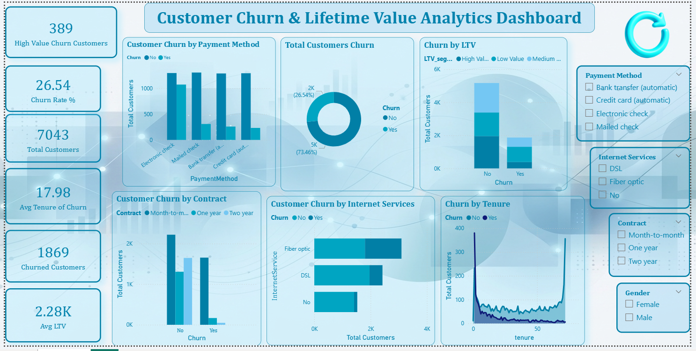
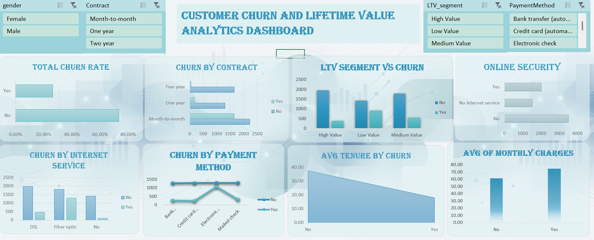

<h1 align="center">Customer Churn & Lifetime Value Analytics</h1>

End-to-End Business Analytics Project using SQL, Python, Excel and Power BI 
Based on the IBM Telco Customer Churn Dataset from Kaggle

<h2>📌 Project Overview</h2>

This project analyzes customer churn behavior and identifies high-value customers at risk using the IBM Telco Customer Churn dataset. 
The objective is to simulate a real-world analytics workflow — from data extraction to business insights and dashboard reporting.

<h2>🎯 Business Problem</h2>

Telecom companies face revenue loss due to customer attrition. This project aims to:
<ul>
<li>Identify key factors driving customer churn</li>
<li>Calculate Customer Lifetime Value (LTV)</li>
<li>Segment customers based on value</li>
<li>Propose data-driven retention strategies</li>
</ul>

<h2>🛠️ Tools & Technologies Used</h2>
<ul>
<li>SQL (MySQL) – Data querying and business views</li>
<li>Python (Pandas, Matplotlib, Seaborn) – Data cleaning, feature engineering, analysis</li>
<li>Excel – Pivot validation and summary analysis as well as dashboard creation</li>
<li>Power BI – Interactive dashboard and KPI reporting</li>
</ul>

<h2>📊 Key Features of Analysis</h2>
<ul>
<li>Churn rate analysis by contract, internet service, and payment method</li>
<li>Creation of Customer Lifetime Value (LTV) metric</li>
<li>LTV-based customer segmentation (Low, Medium, High value)</li>
<li>Identification of high-value customers at churn risk</li>
<li>Interactive dashboard for business decision-making</li>
</ul>

<h2>📁 Project Structure</h2>

<pre>
customer-churn-ltv-analytics/
│
├── Customer_Churn_Dataset.csv
├── telco_cleaned.csv
├── analysis.py
├── dashboard.png
├── excel_dashboard.png
├── customer_churn.xlsx
├── customer_churn.sql
└── README.md
</pre>

<h2>📈 Dashboard Preview</h2>

Screenshot of the Power BI dashboard:

Screenshot of the Excel dashboard:

<h2>💡 Key Insights</h2>
<ul>
<li>Month-to-month contract customers show the highest churn rate</li>
<li>Fiber internet users with higher charges are more likely to churn</li>
<li>Electronic check users display higher churn behavior</li>
<li>High LTV customers are also at risk, impacting revenue</li>
</ul>

<h2>✅ Business Recommendations</h2>
<ul>
<li>Promote long-term contracts with loyalty incentives</li>
<li>Target high-charge fiber users after 6 months with offers</li>
<li>Encourage auto-pay methods to reduce churn probability</li>
<li>Implement proactive retention for high-value customers</li>
</ul>

Created as part of a Business Analytics project demonstrating end-to-end analytics workflow.

